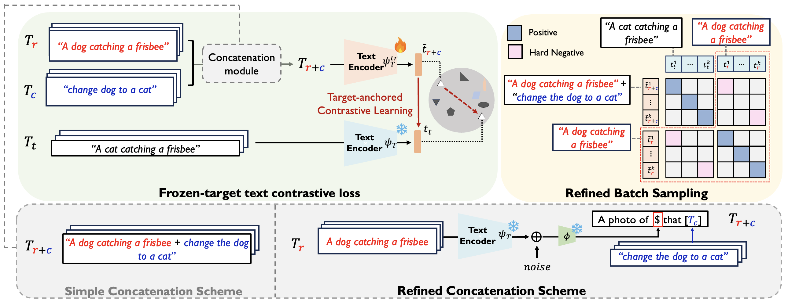

This is the official PyTorch implementation of "RTD: An Efficient Post-hoc Framework for Reducing Task Discrepancy of Text Encoders for Composed Image Retrieval" (Accepted to ICCV 2025)


[](https://arxiv.org/abs/2406.09188)


Welcome to the official Pytorch implementation of RTD!
## Overview



Composed Image Retrieval (CIR) aims to retrieve a target image based on a reference image and conditioning text, enabling controllable image searches. The mainstream Zero-Shot (ZS) CIR methods bypass the need for expensive training CIR triplets by projecting image embeddings into the text token embedding space, forming a composed query for retrieval. However, we highlight an inherent limitation in these projection-based CIR: a task discrepancy of text encoders between the original pre-training task of the encoders (text ↔ image) and the target CIR task (image + text ↔ image), which potentially negatively impacts CIR performance.
To reduce such a discrepancy, a naive solution would be to train both image and text encoders with CIR triplets in a supervised manner. Instead, we introduce Reducing Task Discrepancy of text encoders for Composed Image Retrieval (RTD), an efficient text-only post-hoc framework that complements projection-based CIR methods. We devise a novel frozen-target text contrastive learning designed to enhance the capability of the text encoder for CIR. We also propose two key enhancements: (1) a hard negative-based refined batch sampling strategy and (2) a refined concatenation scheme to further mitigate training-inference discrepancy. 
Integrating RTD into state-of-the-art projection-based methods achieves performance comparable to, or even surpassing, resource-intensive state-of-the-art synthetic CIR triplet-based approaches, only with 23 minutes of additional training on 4 A100 GPUs in training.


## Installation
```bash
$ pip install torch transformers diffusers accelerate datasets spacy
$ python -m spacy download en_core_web_sm
```

## Training dataset 
You can download the json file (main training text triplets from Compodiff) from [this link](https://drive.google.com/drive/folders/1gLO8yUpR5RYKZ-ADtBZHKVjKk1hBXe_E?usp=sharing)


## Training
```bash
$ python3 -m torch.distributed.run --nproc_per_node 4 --nnodes 1 --node_rank 0 \
--master_addr localhost --master_port 5100 train_text_encoder.py  \
--batch_size 128 \
--output_dir /path/to/your_experiment \
--cirr_dataset_path /path/to/your_dataset/CIRR \
--clip_model_name large \
--validation_steps 100 \
--checkpointing_steps 100 \
--seed 12345 \
--lr_scheduler constant_with_warmup --lr_warmup_steps 0 \
--max_train_steps 2000 \
--phi_checkpoint "/path/to/your_checkpoint/phi_best.pt" \
--caption_dir "/path/to/your_dataset/LLM_triplets.json" \
--learning_rate 1e-5  \
--mixed_precision "fp16" 
```

## Evaluation
### CIRR (Val Set)
```bash
$ python3 validate.py \
--eval-type phi \
--dataset cirr \
--dataset-path /path/to/your_dataset/CIRR \
--phi-checkpoint-name "/path/to/your_checkpoint/phi_best.pt"   \
--text-encoder-checkpoint-name  "/path/to/your_experiment/text_encoder_best.pt"    \
--clip_model_name large
```


## Acknowledgement
Our code implementation is largely borrowed from [LinCIR](https://github.com/navervision/lincir/tree/master) and [SEARLE](https://github.com/miccunifi/SEARLE) since our method is mainly built upon them. We appreciate the original authors for their invaluable contributions.

